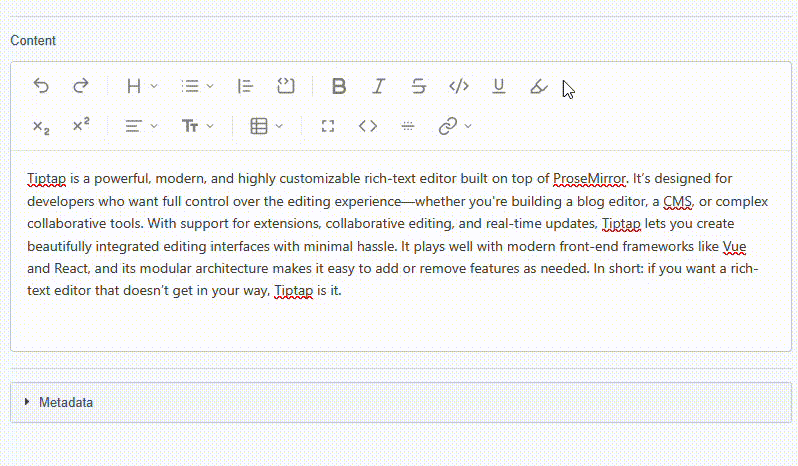
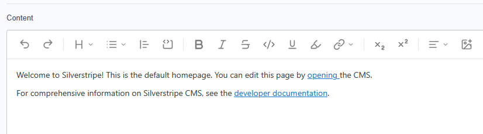
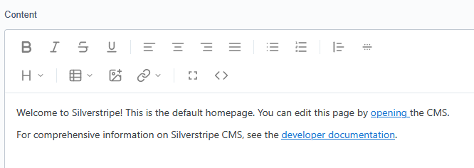

# SilverStripe TipTap WYSIWYG Editor



A modern WYSIWYG editor for SilverStripe using the powerful and extensible [TipTap](https://tiptap.dev) editor.

With SilverStripe 6 moving TinyMCE to an optional plugin, now's the perfect time to upgrade to something **better**.

# Install

`composer remove silverstripe/htmleditor-tinymce`

`composer require otago/silverstripe-tiptap`

---

## Configuration

For a full configuration guide, see the [configuration document](docs/CONFIGURATION.md).

### Available Toolbar Items

- **bold** - Bold text button (Ctrl+B)
- **italic** - Italic text button (Ctrl+I)
- **underline** - Underline text button (Ctrl+U)
- **strikethrough** - Strikethrough text button (Ctrl+Shift+X)
- **code** - Inline code button (for `inline code` snippets) (Ctrl+E)
- **subscript** - Subscript button (for X<sub>2</sub> formatting) (Ctrl+,)
- **superscript** - Superscript button (for X<sup>2</sup> formatting) (Ctrl+.)
- **highlight** - Text highlight button
- **paragraph** - Paragraph button
- **heading1** - Heading 1 button (Ctrl+Alt+1)
- **heading2** - Heading 2 button (Ctrl+Alt+2)
- **heading3** - Heading 3 button (Ctrl+Alt+3)
- **heading4** - Heading 4 button (Ctrl+Alt+4)
- **heading5** - Heading 5 button (Ctrl+Alt+5)
- **heading6** - Heading 6 button (Ctrl+Alt+6)
- **heading** - Heading dropdown (H1, H2, H3, Paragraph) - *Alternative to individual buttons*
- **bulletList** - Bullet list button
- **orderedList** - Numbered list button
- **lists** - List dropdown (Bullet List, Numbered List) - *Alternative to individual buttons*
- **alignLeft** - Align text left button (Ctrl+L)
- **alignCenter** - Align text center button (Ctrl+E)
- **alignRight** - Align text right button (Ctrl+R)
- **alignJustify** - Justify text button (Ctrl+J)
- **align** - Text alignment dropdown (Left, Center, Right, Justify) - *Alternative to individual buttons*
- **styles** - Custom styles dropdown (configurable CSS classes)
- **table** - Table dropdown (Insert Table, Add/Delete Rows/Columns, Merge/Split Cells, Toggle Headers)
- **blockquote** - Blockquote button (Ctrl+Shift+B)
- **horizontalRule** - Insert horizontal rule (`<hr/>`) button
- **codeBlock** - Code block button (Ctrl+Alt+C)
- **link** - Link button (basic prompt-based) (Ctrl+K)
- **image** - Image button (basic prompt-based)
- **undo** - Undo button (Ctrl+Z)
- **redo** - Redo button (Ctrl+Y)
- **fullscreen** - Toggle fullscreen mode button (F11)
- **htmlSource** - Toggle HTML source view button (Ctrl+Shift+H)
- **separator** - Visual separator between button groups
- **newline** - Force toolbar to wrap to the next line
- **dropdown** - Create grouped dropdowns with custom titles, icons, and actions

There are also SilverStripe specific extensions. These also serves as examples if you want to customise TipTap:


- **ss-link-site** - links to an exisiting page in the SilverStripe SiteTree
- **ss-link-ext** - external links, anchor tags, routes etc.
- **ss-link-file** - links to a SilverStripe file inside assets
- **ss-link-media** - embeds an image

---

### 📐 TipTap-like Toolbar (recommended)

To enable this, create a config file at `app/_config/tiptap.yml`:



```yaml
SilverStripe\Forms\HTMLEditor\HTMLEditorField:
  tiptap_config:
    toolbar:
      - 'undo'
      - 'redo'
      - 'separator'
      - 'dropdown':
          title: 'Heading and Paragraph'
          icon: 'headings'
          actions:
            - 'heading1'
            - 'heading2'
            - 'heading3'
            - 'paragraph'
      - 'dropdown':
          title: 'Lists'
          icon: 'lists'
          actions:
            - 'bulletList'
            - 'orderedList'
      - 'blockquote'
      - 'codeBlock'
      - 'separator'
      - 'bold'
      - 'italic' 
      - 'strikethrough'
      - 'code'
      - 'underline'
      - 'highlight'
      - 'dropdown':
          title: 'Links'
          icon: 'links'
          actions:
            - 'ss-link-site': 'otago/silverstripe-tiptap: client/ext/silverstripe-link-page-on-site.js'
            - 'ss-link-ext': 'otago/silverstripe-tiptap: client/ext/silverstripe-link-external.js'
            - 'ss-link-file': 'otago/silverstripe-tiptap: client/ext/silverstripe-link-file.js'
      - 'separator'
      - 'subscript'
      - 'superscript'
      - 'separator'
      - 'dropdown':
          title: 'Align'
          icon: 'align'
          actions:
            - 'alignLeft'
            - 'alignCenter'
            - 'alignRight'
            - 'alignJustify'
      - 'ss-link-media': 'otago/silverstripe-tiptap: client/ext/silverstripe-link-media.js'
```


### 🧩 SilverStripe-like Toolbar (minimalist)



This example replicates the traditional SilverStripe editor layout:

```yaml
SilverStripe\Forms\HTMLEditor\HTMLEditorField:
  tiptap_config:
    toolbar:
      - 'bold'
      - 'italic' 
      - 'strikethrough'
      - 'underline'
      - 'separator'
      - 'alignLeft'
      - 'alignCenter'
      - 'alignRight'
      - 'alignJustify'
      - 'separator'
      - 'bulletList'
      - 'orderedList'
      - 'separator'
      - 'blockquote'
      - 'horizontalRule'
      - 'newline'
      - 'dropdown':
          title: 'Heading and Paragraph'
          icon: 'headings'
          actions:
            - 'heading1'
            - 'heading2'
            - 'heading3'
            - 'paragraph'
      - 'separator'
      - 'table'
      - 'ss-link-media': 'otago/silverstripe-tiptap: client/ext/silverstripe-link-media.js'
      - 'dropdown':
          title: 'Links'
          icon: 'links'
          actions:
            - 'ss-link-site': 'otago/silverstripe-tiptap: client/ext/silverstripe-link-page-on-site.js'
            - 'ss-link-ext': 'otago/silverstripe-tiptap: client/ext/silverstripe-link-external.js'
            - 'ss-link-file': 'otago/silverstripe-tiptap: client/ext/silverstripe-link-file.js'
      - 'separator'
      - 'fullscreen'
      - 'htmlSource'
```
